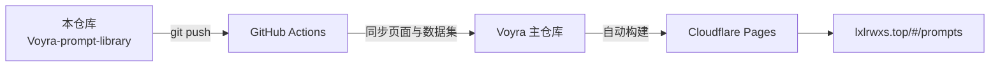

<div align="center">

# 📚 Voyra · 提示词库 · Prompt Library

**80 条精选提示词，变量填空一键复制 ｜ 80 curated prompts with variable fill-in and one-click copy**

[](https://github.com/liixnglinb/Voyra-prompt-library/actions/workflows/sync-to-voyra.yml)


### [🌐 在线演示 Live Demo](https://lxlrwxs.top/#/prompts) ｜ [🏠 Voyra 主站 Main Site](https://lxlrwxs.top) ｜ [📦 主仓库 Main Repo](https://github.com/liixnglinb/Voyra)

</div>

---

## ✨ 功能特性 / Features

- **80 条内置精选 / 7 大分类**：写作、职场、编程、学习、生活、健康、AI 开发，每类再分子类。
  *80 built-in prompts across 7 categories — Writing, Workplace, Coding, Learning, Life, Health, AI Dev — each with subcategories.*
- **【变量】智能填空**：识别提示词中的 `【变量】` 占位，逐项填写后实时拼装，一键复制成品。
  *Detects 【variable】 slots, fills them interactively and composes the final prompt for one-click copy.*
- **全文快速搜索**：标题/正文模糊检索，按 `Esc` 立即退出。
  *Instant fuzzy search across titles and bodies; press Esc to exit.*
- **收藏与自定义**：星标收藏常用条目，也能创建、编辑自己的提示词与分类。
  *Star favorites, and create/edit your own prompts and categories.*
- **随机抽一个**：灵感枯竭时随机抽取一条。
  *"Surprise me" picks a random prompt.*
- **本地 / 云端双模式**：默认 localStorage 离线可用，登录后云端同步。
  *Works offline via localStorage; optional cloud sync after sign-in.*

## 🛠 技术栈 / Tech Stack

| 类别 Category | 技术 Stack |
| --- | --- |
| 框架 Framework | React 18（Hooks） |
| 构建 Build | Vite 5 |
| 样式 Styling | Tailwind CSS |
| 数据 Data | 内置预设数据集 + localStorage（+ Bmob 云端层） |
| 图标 Icons | lucide-react |

## 📁 目录结构 / Structure

```
src/
├── pages/
│   └── PromptLibrary.jsx      # 提示词库主界面：分类/搜索/填空/复制/收藏
│                              # Main UI: categories, search, fill-in, copy
└── data/
    └── prompt-presets.js      # 80 条内置提示词数据集 / Built-in dataset
```

## 🔗 与 Voyra 主仓库的关系 / How It Syncs

本仓库是 Voyra 个人工具中心「提示词库」模块的**独立源码仓库**：代码在本仓库维护，每次 `push` 由 GitHub Actions 自动同步到 Voyra 主仓库的相同路径，主仓库统一构建并部署到 Cloudflare Pages。

*Standalone source repo of the Prompt Library module. Every push is auto-synced into the main Voyra repository, which builds and deploys the whole site.*



## 🚀 本地开发 / Development

模块依赖主仓库共享层（路由、鉴权、通用组件），完整运行请克隆主仓库：

*Depends on the main repo's shared layer. Clone the main repo to run locally:*

```bash
git clone https://github.com/liixnglinb/Voyra.git
cd Voyra && npm install && npm run dev
```

新增/修改内置提示词，编辑 `src/data/prompt-presets.js` 后在本仓库推送即可。

*To edit built-in prompts, modify `src/data/prompt-presets.js` and push here.*

## 📄 许可证 / License

MIT © [liixnglinb](https://github.com/liixnglinb)

## 🔍 关键词 / Keywords

提示词库 ChatGPT提示词 AI提示词 提示词大全 Prompt 提示词管理 变量模板 一键复制 ｜ prompt library chatgpt prompts ai prompts curated templates copy react vite
